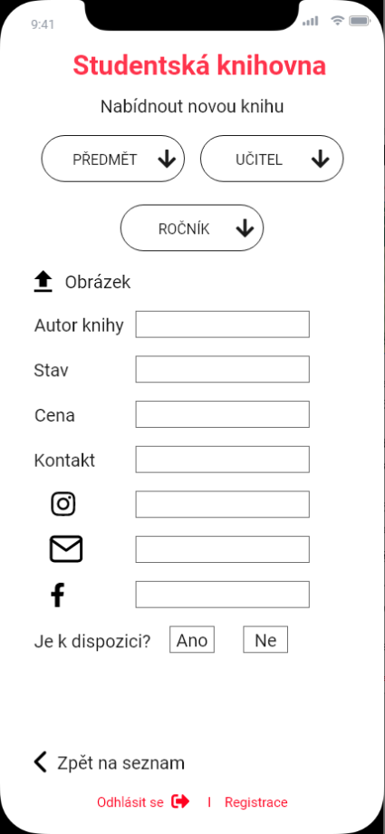

# Studentská knihovna

Takže jsem navrhl mobilní aplikaci proprodej a nákup učebnic. 

## Jak to funguje

* Přihlásí se a to ho hodí na stránku se seznamem knih
* Dále si podle 4 filtrů bude moct nastavit co chce, aby se mu lépe vyhledávalo ve seznamu
* Po rozkliknutí detailů se zobrazí vsechny všechny informace zadané od prodejce učebnice
* Pokud si chce učebnici koupit, tak bude muset prodejce kontaktovat pomocí uvedených dat
- Pokud chcete knihu prodat, tak se musí kiknout na tlačítko **Nová kniha**
- Otevře se mu další stránka, kam musí vyplnit všechna pole až na kontakt, kde musí být nejméně 1 vyplněna

## Technická funkčnost

- Nejsem si jistý, zda-li je potřeba login, nebo budeme věřit lidem, že nebudou shitpostit a nebudou tam dávat blbosti.
- Prodej učebnice bude ukončen v tu chvíli, kdy bude button **Je k dispozici přepnut** do ne.
-  

## Design

## Barevná paleta
- #1A1A1A
- #FF344C
- #FFFFFF
- #2F65B0
